# Features

A complete list of layers that GTFS-cooker can generate.

## Basic Layers

### Stops

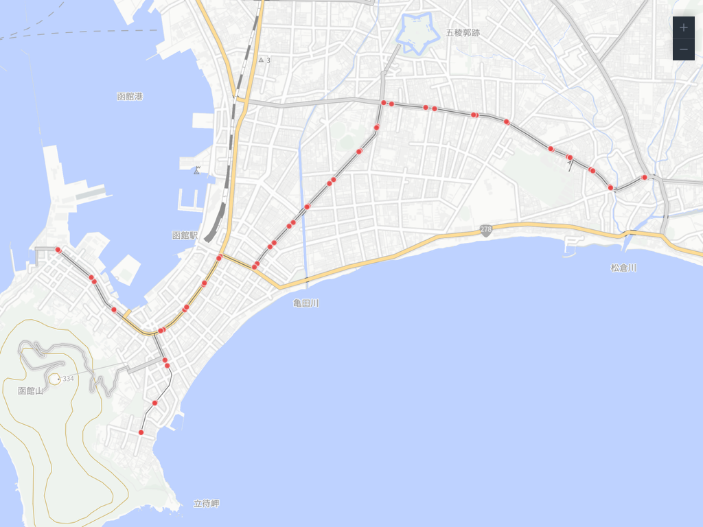

- **Geometry**: Point
- **Description**: Outputs all GTFS stops as point features.
- **Key properties**: stop_id, stop_name, stop_lat, stop_lon, routes (list of route IDs passing through), route_count, trip_weekday (weekday trips), trip_holiday (holiday trips), trip_morning / trip_daytime / trip_evening / trip_latenight (trips by time period), trip_04–trip_27 (hourly trips)

### Lines

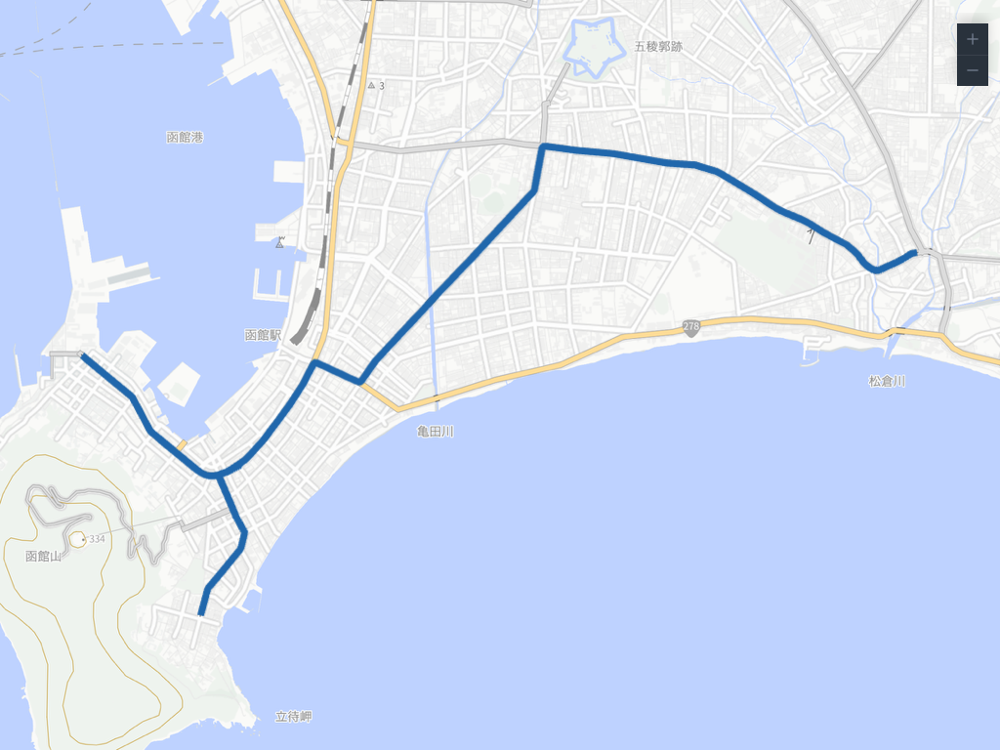

- **Geometry**: LineString / MultiLineString
- **Description**: Generates route geometries from shapes.txt. Falls back to stop sequences if shapes.txt is unavailable.
- **Key properties**: route_id, route_short_name, route_long_name, route_type, route_color, agency_name, trip_weekday, trip_holiday, trips by time period, hourly trips

### Trips

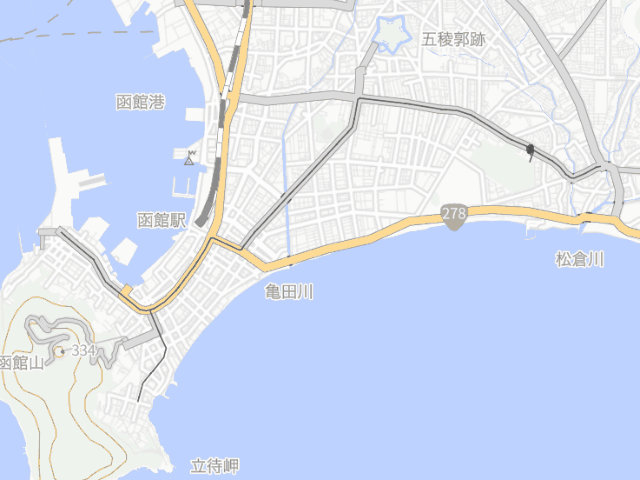

- **Geometry**: LineString (Kepler.gl Trip format)
- **Description**: Outputs trips for a given date with timestamp information. Can be imported into Kepler.gl for animated visualization.
- **Required parameter**: Base date
- **Key properties**: trip_id, route_id, service_id, direction_id, trip_headsign

### Segments

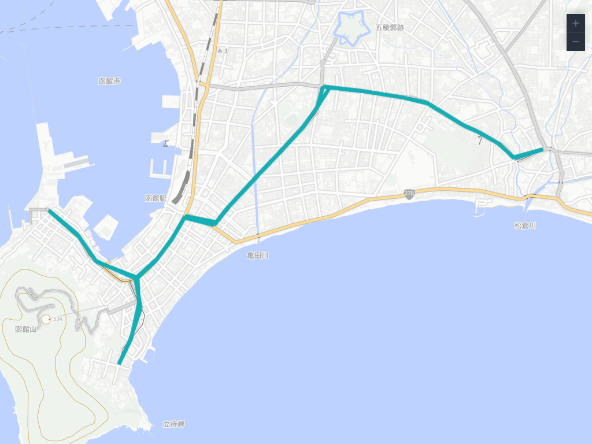

- **Geometry**: LineString
- **Description**: Generates stop-to-stop segments per route with trip frequency.
- **Key properties**: from_stop_id, from_stop_name, to_stop_id, to_stop_name, route_id, trip_weekday, trip_holiday, trips by time period, distance_m

## Buffer & Dissolved Layers

### Stops Buffer / Lines Buffer

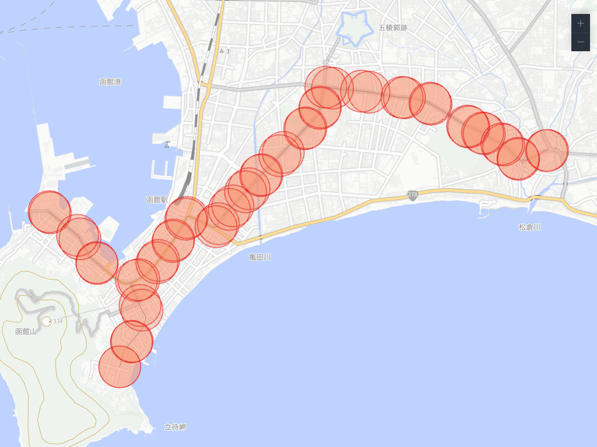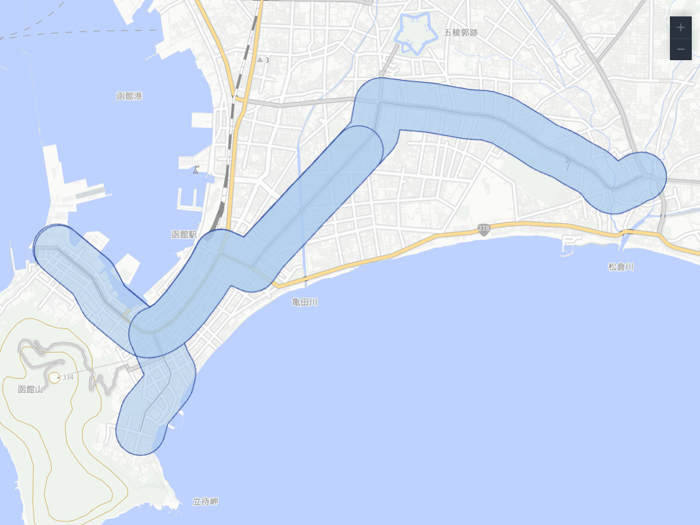

- **Geometry**: Polygon
- **Description**: Generates a buffer (catchment area) around each stop or route line.
- **Parameter**: Buffer radius (meters, default 300m)

### Stops Dissolved / Lines Dissolved

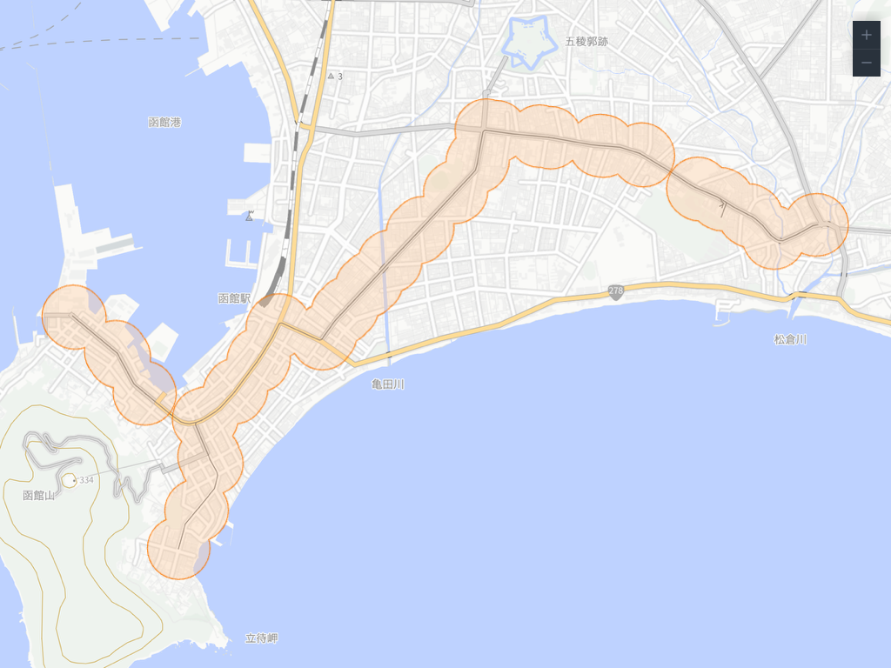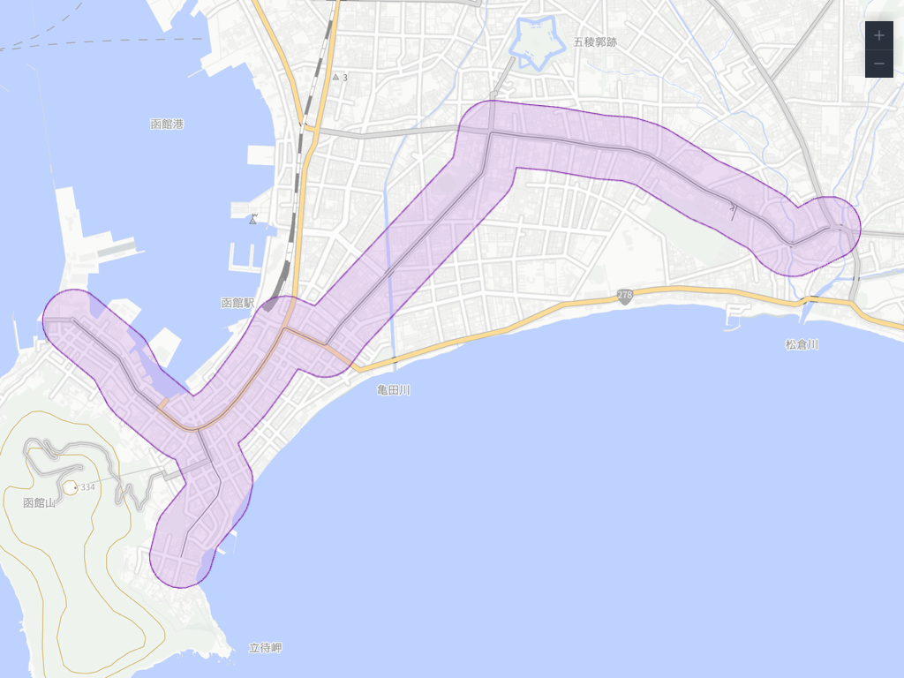

- **Geometry**: Polygon
- **Description**: Merges (dissolves) buffers to represent the service area of the transit network.
- **Group by**: None (merge all) / Agency / Route / Shape

## Area Layers

### Envelope (Bounding Box)

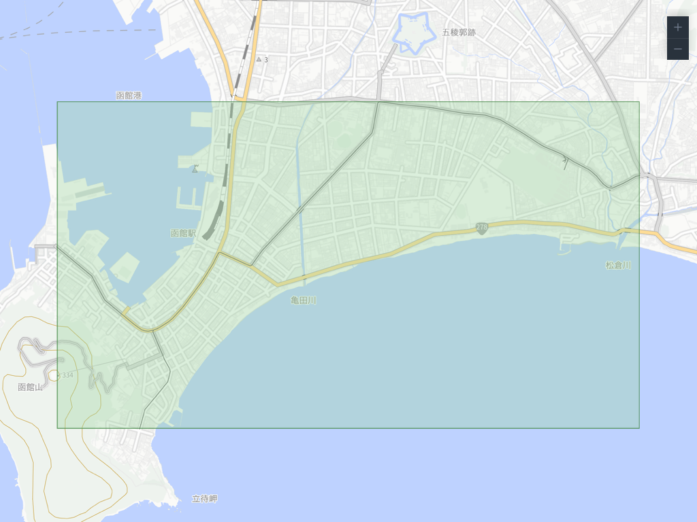

- **Geometry**: Polygon
- **Description**: Generates the minimum bounding rectangle of all stops.

### Convex Hull

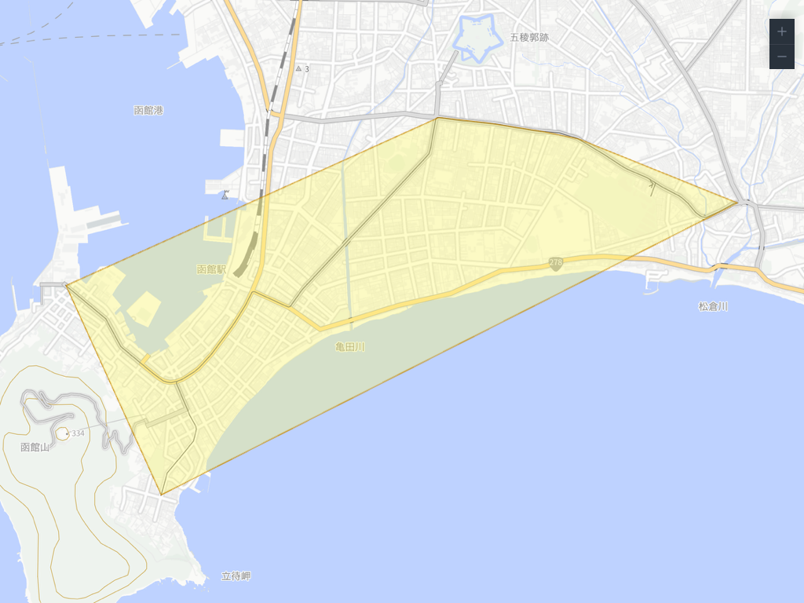

- **Geometry**: Polygon
- **Description**: Generates the smallest convex polygon enclosing all stops.

### Concave Hull

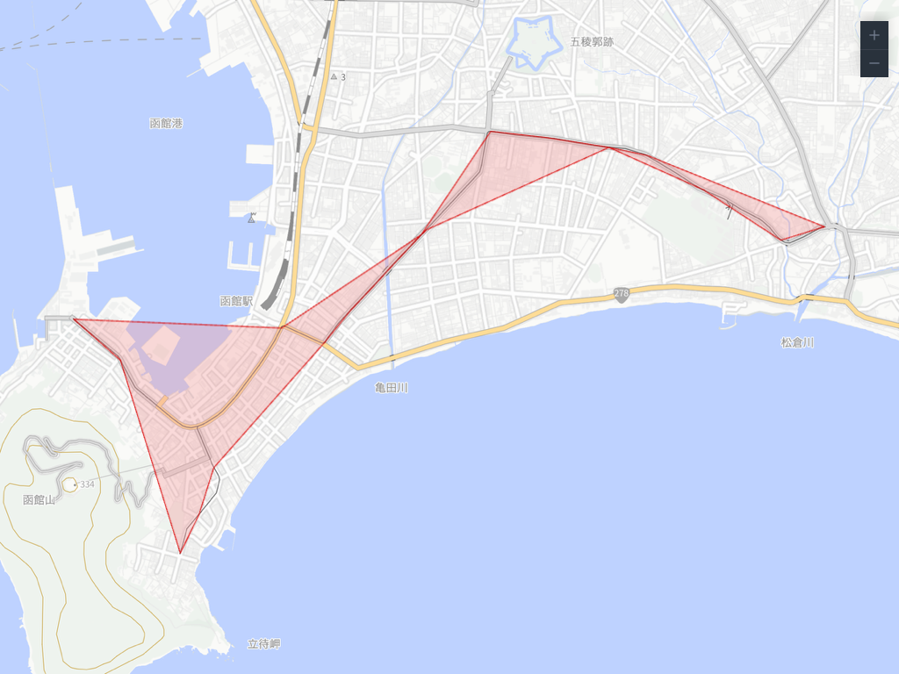

- **Geometry**: Polygon
- **Description**: Generates a concave polygon that follows the distribution of stops. Adjust the max edge length parameter for tighter or looser boundaries.
- **Parameter**: Max edge length (km, default 2km)

## Matching Layers

Layers generated by joining ridership data with GTFS. See [Matching (Ridership)](./matching) for details.

| Layer | Geometry | Description |
|-------|----------|-------------|
| Matching Stops | Point | Ridership by stop (sized by boarding + alighting count) |
| Matching Lines | LineString | Ridership by route (line width reflects count) |
| Matching Segments | LineString | Ridership by segment |
| Matching Flow | Arc | OD flow (aggregated by boarding/alighting stop pair) |
| Matching OD | Arc | OD records (one arc per individual record) |

## Trip Count Definitions

### Weekday / Holiday

The days of the week used for trip count aggregation are as follows:

| Property | Aggregation target | calendar.txt condition |
|----------|-------------------|----------------------|
| trip_weekday | Weekday trips | monday = 1 |
| trip_holiday | Holiday trips | sunday = 1 |

### Time Periods

Trip counts are categorized into the following time periods:

| Period | Property | Hours |
|--------|----------|-------|
| Morning | trip_morning | 4:00 – 8:59 |
| Daytime | trip_daytime | 9:00 – 16:59 |
| Evening | trip_evening | 17:00 – 20:59 |
| Late night | trip_latenight | 21:00 – 27:59 |

::: info
Hourly trip counts (trip_04–trip_27) and time-period trip counts are both weekday counts. The sum of time-period counts equals trip_weekday.
:::
