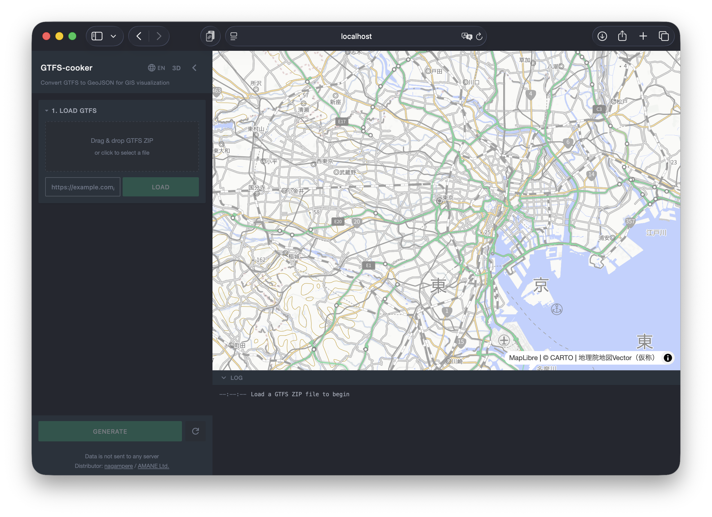
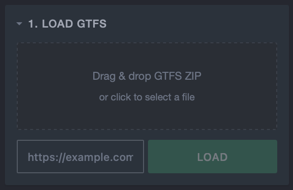
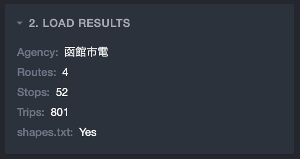
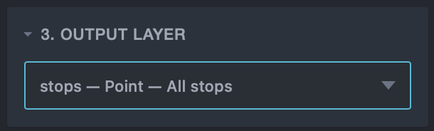
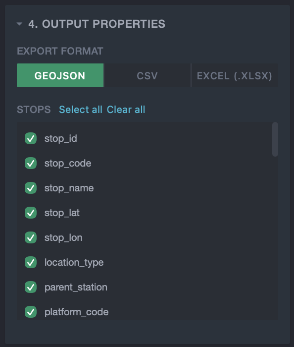
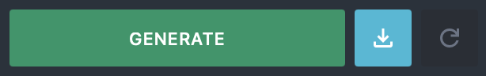

# Getting Started

This guide walks through the basic workflow of GTFS-cooker.

## 1. Load a GTFS File

In the sidebar section "1. Load GTFS", load a GTFS ZIP file using one of the following methods:

- **Drag & drop** — Drag a ZIP file onto the drop zone.
- **File picker** — Click the drop zone to open a file dialog.
- **URL input** — Enter a GTFS ZIP URL and click "Load".

::: tip
GTFS data can be obtained from transit agency open data portals or aggregators such as [Mobility Database](https://mobilitydatabase.org/) and [Public Transportation Open Data Center (ODPT)](https://ckan.odpt.org/dataset).
:::

Once loading is complete, "2. Load Results" will display agency names, route count, stop count, and trip count. Validation warnings are shown if any issues are detected.

## 2. Select an Output Layer

In the "3. Output Layer" section, choose the layer you want to generate from the dropdown.

| Category | Layer | Description |
|----------|-------|-------------|
| Basic | Stops | Point features for all stops |
| Basic | Lines | Route geometries |
| Basic | Trips | Trip trajectories (Kepler.gl Trip format) |
| Buffer | Stops Buffer / Lines Buffer | Buffers around stops or routes |
| Dissolved | Stops Dissolved / Lines Dissolved | Merged buffers |
| Area | Envelope / Convex / Concave | Bounding box, convex hull, concave hull |
| Segment | Segments | Stop-to-stop segments |
| Matching | Matching Stops / Lines / Segments / Flow / OD | Ridership data overlay |

Some layers display additional parameters (base date, buffer radius, etc.). See [Features](./features) for details on each layer.

## 3. Select Output Properties

In the "4. Output Properties" section, configure which properties to include in the export.

- **Export format** — Choose from GeoJSON / CSV / XLSX.
- **Property selection** — Use "Select all" / "Clear all" for bulk operations, or toggle individual checkboxes.

## 4. Generate and Download

Click the "Generate" button to create the selected layer. Results are previewed on the map, and you can hover over features to inspect their properties.

Once generation is complete, the download button to the left of the "Generate" button becomes clickable. Click it to download the file in the format selected under "4. Output Properties" (GeoJSON / CSV / XLSX).

Downloaded files can be used with GIS tools for visualization and analysis:

- **[Kepler.gl](https://kepler.gl/)** — Simply drag and drop GeoJSON or CSV files to visualize on a map in the browser. Loading a Trips layer enables time-series animation.
- **[QGIS](https://qgis.org/)** — A desktop GIS application. GeoJSON files can be loaded directly for styling and spatial analysis.
- **Excel / Google Sheets** — Export as CSV or XLSX to aggregate properties and create charts in spreadsheet applications.

## 5. Map Controls

- **2D / 3D toggle** — Switch between top-down and perspective views using the header buttons.
- **Pan** — Drag to move the map.
- **Zoom** — Use the mouse wheel to zoom in/out.
- **Rotate (3D)** — Right-click + drag to rotate the view.

## Log Panel

The "Log" panel at the bottom of the screen shows processing progress and any errors.
