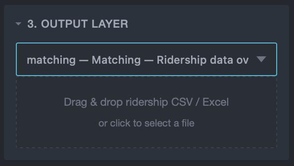
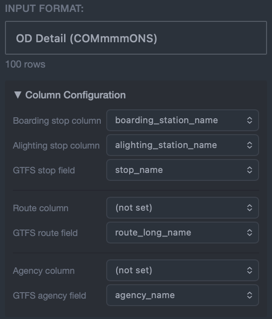
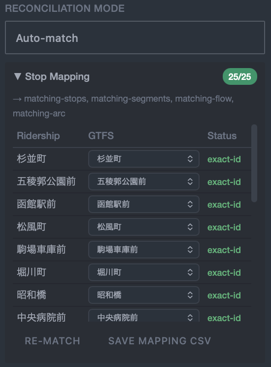

# Matching (Ridership)

<p align="center"></p>

The Matching feature joins ridership data (CSV / Excel) with GTFS data to generate visualization layers by stop, route, segment, or OD flow.

### Why join ridership data?

GTFS data alone provides route geometries and timetables, but it cannot tell you which stops are heavily used or where passenger demand is concentrated. By joining ridership data, you can:

- **Understand stop-level usage** — Visualize boarding and alighting counts per stop to assess each stop's importance.
- **Analyze route and segment demand** — Compare ridership across routes and segments to identify high- and low-demand areas.
- **Visualize OD flows** — Aggregate origin-destination pairs and display travel patterns as arcs on the map.
- **Support planning decisions** — Identify underutilized segments or peak-hour imbalances to inform route restructuring and schedule adjustments.

## Overview

```
Load ridership file → Format detection → Column config → Reconciliation → Execute join → Generate layer
```

## Steps

### Step 1: Select the Matching Layer

From the "3. Output Layer" dropdown, select **Matching — Ridership data overlay**. This reveals the "5. Ridership Data" section in the sidebar.

### Step 2: Load a Ridership File

Drag & drop or select a CSV / Excel / TSV file.

<p align="center"></p>

- For Excel files with multiple sheets, a sheet selector dropdown appears.
- The format is auto-detected from column headers. You can override the detection if needed.

### Step 3: Format and Column Configuration

Review the detected format and, if necessary, adjust column mappings in the "Column Configuration" panel. The visible fields and required mappings depend on the format.

<p align="center"></p>

#### Available column settings

| Setting | Description | Affects sub-layers |
|---------|-------------|--------------------|
| Boarding stop column | Stop name/ID for boarding | matching-stops, matching-segments, matching-flow, matching-od |
| Alighting stop column | Stop name/ID for alighting | matching-segments, matching-flow, matching-od |
| GTFS stop field | Match target (`stop_id` / `stop_name`) | all stop-based layers |
| Route column | Route name/ID | matching-lines, route filter |
| GTFS route field | Match target (`route_id` / `route_short_name` / `route_long_name`) | matching-lines |
| Agency column | Agency name/ID | (not used in aggregation yet) |
| GTFS agency field | Match target (`agency_id` / `agency_name`) | (same) |
| Boarding count / Alighting count | Separate boarding / alighting counts (`count_on` / `count_off`) | stop's `ridership_on` / `ridership_off` |
| Count columns (multi) | Per-row sum of selected columns becomes the row's ridership | all ridership values |
| Trip ID column | Trip ID for per-trip pass-through accounting | matching-segments (trip-detail path) |
| Pass-through count | Pass-through passenger count at the stop | matching-segments (trip-detail path) |
| Date column | Optional. Use when date and time are in separate columns. Auto-detected names: `boarding_date`, `service_date`, `運行日`, `日付`, etc. Supported formats: `YYYY-MM-DD`, `YYYY/MM/DD`, `YYYYMMDD`, `MM/DD/YYYY`, etc. | matching-trips / matching-ridership |
| Time column | Time-of-day or full datetime, used for hourly aggregation and trip assignment. **Required for Stop × Trip Detail**. Auto-detected: `boarding_at`, `payment_at`, `datetime`, `時刻`, `発車時刻`, etc.<br>**Without date column**: expects full datetime like `2026-05-21 07:47:17`.<br>**With date column**: expects time-of-day only (`07:47:17` / `07:47` / `7`). | all layers' `ridership_*` and period columns |

When the time column is set, the hour is extracted from formats such as `HH:MM:SS`, `YYYY-MM-DD HH:MM:SS`, ISO 8601, or a plain integer hour, exposing `ridership_morning`–`ridership_latenight` and `ridership_04`–`ridership_27` columns. The buckets mirror the GTFS `trip_XX` definitions (morning 4–8 / daytime 9–16 / evening 17–20 / latenight 21–27).

#### Per-format configuration

##### OD Detail (COMmmmONS) / OD Detail

Individual records where each row represents one rider's full journey (boarding + alighting).

::: tip Reference
For the COMmmmONS data specification, see MLIT's [Public Transport Data Standard (COMmmmONS)](https://www.mlit.go.jp/commmmons/document/005/).
:::

| Required | Setting | Typical column |
|----------|---------|----------------|
| ✅ | Boarding stop | `boarding_station_name` / `boarding_station_code` |
| ✅ | Alighting stop | `alighting_station_name` / `alighting_station_code` |
| ✅ | Count columns | `adult_passenger_count` and other passenger-category columns |
| Optional | Route | `boarding_route_id` (matched against GTFS `route_id`) |
| Optional | Agency | `operating_agency_name` / `operating_agency_code` |
| Optional | Time | `payment_at` (timestamp) |

→ Sub-layers: matching-stops, matching-lines, matching-segments, matching-flow, matching-od

##### OD Aggregate

One row per OD pair with a count.

| Required | Setting | Typical column |
|----------|---------|----------------|
| ✅ | Boarding stop | `boarding_station_name` / `boarding_station_code` |
| ✅ | Alighting stop | `alighting_station_name` / `alighting_station_code` |
| ✅ | Count | `count` |
| Optional | Route / Agency | — |
| Optional | Time | `hour` / `time_band` |

→ Sub-layers: matching-stops, matching-segments, matching-flow, matching-od (and matching-lines if a route column is set)

##### Stop Aggregate

Boarding and alighting counts per stop. No alighting destination, so OD-style layers are unavailable.

| Required | Setting | Typical column |
|----------|---------|----------------|
| ✅ | Boarding stop | `station_name` / `station_code` |
| ✅ | Boarding count | `count_on` |
| ✅ | Alighting count | `count_off` |
| Optional | Time | `hour` / `time_band` |

→ Sub-layers: matching-stops only

##### Route Aggregate

One row per route (system). No stop info, so stop / segment / OD layers cannot be generated.

| Required | Setting | Typical column |
|----------|---------|----------------|
| ✅ | Route | `boarding_route_name` / `route_name` / `route_id` |
| ✅ | Count | `count` |
| Optional | Agency / Time | — |

→ Sub-layers: matching-lines only

##### Stop × Trip Detail

Per-(stop, trip) rows with boardings, alightings, and pass-through. The alighting-stop column is replaced by **trip ID + time column + pass-through count**: stops within a trip are ordered chronologically by time to derive segment-level pass-through.

| Required | Setting | Typical column |
|----------|---------|----------------|
| ✅ | Boarding stop | `停留所名` / `停留所ID` |
| ✅ | Boarding count | `乗車人数` |
| ✅ | Alighting count | `降車人数` |
| ✅ | Trip ID | `便ID` |
| ✅ | Pass-through count | `通過人数` |
| ✅ | Time column | `時刻` / `発車時刻` / `datetime` |
| Optional | Route | `路線名` / `路線ID` |

The time column is auto-detected at load time and is required for this format — it serves both as the in-trip ordering key and as the input for hourly aggregation (`ridership_morning` through `ridership_27`).

→ Sub-layers: matching-stops, matching-segments (trip-detail path); matching-lines if a route column is set

### Step 3.5: Additional Options

Below the sub-layer selector:

- **Route filter** (optional) — Enter a substring that matches `route_id`, `route_short_name`, or `route_long_name`. matching-stops keeps only stops served by matching routes; matching-lines and matching-segments keep only features whose properties match.
- **Add ridership / trip columns** (checkbox) — Adds `ridership_per_trip` and per-bucket variants (`ridership_per_trip_04`–`ridership_per_trip_27`, `ridership_per_trip_morning`–`ridership_per_trip_latenight`). The denominator uses the `trip_weekday + trip_holiday` totals already on each feature, and per-bucket ratios use the matching `trip_XX` column. Columns are omitted when the denominator is zero.

### Step 4: Select a Sub-layer

Available sub-layers depend on the column configuration:

<p align="center"></p>

| Sub-layer | Required columns |
|-----------|-----------------|
| Matching Stops | Boarding stop |
| Matching Lines | Route |
| Matching Segments | Boarding stop + Alighting stop (or Stop × Trip Detail) |
| Matching Flow | Boarding stop + Alighting stop |
| Matching OD | Boarding stop + Alighting stop |
| Matching Trips | Boarding stop + Alighting stop + time column (or Stop × Trip Detail) |
| Matching Ridership | Boarding stop + Alighting stop + time column (OD detail only) |

### Step 5: Reconciliation

Map ridership entity names/IDs to GTFS entities. Three modes are available:

<p align="center"></p>

#### Direct (IDs Match)

Use when ridership IDs directly correspond to GTFS IDs. No additional mapping required.

#### Auto-match

The algorithm automatically reconciles names. Matching priority:

1. **Exact ID match** — ridership value matches GTFS ID exactly
2. **Exact name match** — ridership value matches GTFS name exactly
3. **Normalized match** — match after katakana/hiragana conversion and whitespace removal
4. **Partial match** — one value contains the other

Results appear in a mapping table, with each row's status column showing `exact-id` / `exact-name` / `normalized` / `partial` / `unmatched`.

##### Manually fixing the mapping

Rows that ended up as **`unmatched`**, or rows where the auto-match picked the wrong target, can be corrected manually by selecting a different candidate from the GTFS-side dropdown.

- The dropdown shows GTFS entities that are not yet assigned to another row (duplicates are filtered out automatically).
- Picking a candidate switches the status to `manual`, and the row is then included in the join.
- Selecting the blank option (`—`) switches the status to `skipped`, removing the row from aggregation.
- The same dropdown is used to override a wrong auto-match — just choose another candidate.

After editing, click **Execute Join** again to re-aggregate using the new `manual` mappings.

::: tip
Use **Save mapping CSV** to export the current mapping (auto-match + manual fixes combined). It can be re-imported later via **Upload mapping CSV**.
:::

#### Upload Mapping CSV

Upload a pre-built mapping CSV file.

- **Format**: Column 1 = ridership value, Column 2 = GTFS value
- No header row required
- Multiple GTFS values can map to one ridership value (use multiple rows)

### Step 6: Execute Join

Click "Execute Join" to join the data based on the reconciliation results.

<p align="center"></p>

Join statistics are displayed:

- **Matched / Unmatched** — Number of records that were/were not successfully joined
- **Stop coverage** — Percentage of GTFS stops matched by ridership data
- **Route coverage** — Percentage of GTFS routes matched by ridership data

### Step 7: Generate and Download

As with other layers, click "Generate" to create the layer, preview it on the map, and download. Each sub-layer differs in what it outputs and how it is visualized.

#### Matching Stops (Point)

Visualizes ridership per stop.

<p align="center"></p>

- **Geometry**: Point (same location as GTFS Stops)
- **Circle size**: `√(ridership_on + ridership_off) × 20` — busier stops appear larger.
- **Key properties**:
  - All GTFS Stops layer properties (`stop_id`, `stop_name`, `routes`, `trip_weekday`, `trip_morning`–`trip_27`, ...)
  - `ridership_on` (total boardings), `ridership_off` (total alightings)
  - When time column is set: `ridership_morning`–`ridership_latenight`, `ridership_04`–`ridership_27`
  - With **Add ridership / trip columns** on: `ridership_per_trip` and per-period / per-hour `ridership_per_trip_*`
- **Use cases**: hub identification, stop-level demand analysis, detecting stops with peaked time-of-day usage.

#### Matching Lines (MultiLineString)

Visualizes ridership per route.

<p align="center"></p>

- **Geometry**: MultiLineString (same shape as GTFS Lines)
- **Line width**: `√(ridership_count) × 1.5` — busier routes appear thicker.
- **Key properties**: `route_id` / `route_short_name` / `route_long_name` / `ridership_count` plus per-period `ridership_*` and `ridership_per_trip_*`.
- **Use cases**: cross-route demand comparison, identifying congested routes, time-of-day usage pattern analysis.

#### Matching Segments (LineString)

Visualizes pass-through ridership for adjacent-stop segments.

<p align="center"></p>

- **Geometry**: LineString (stop-to-stop or matching GTFS Segments shape)
- **Line width**: `√(ridership) × 1.5` — busier segments appear thicker.
- **Key properties**:
  - `from_stop_id` / `from_stop_name` / `from_stop_lat` / `from_stop_lon`
  - `to_stop_id` / `to_stop_name` / `to_stop_lat` / `to_stop_lon`
  - `ridership` (segment pass-through count)
  - When time column is set: `ridership_morning`–`ridership_27`
  - With ratio checkbox on: `ridership_per_trip_*`
- **Use cases**: within-route congestion analysis, bottleneck detection, time-of-day segment demand variation.

#### Matching Flow (Arc, aggregated OD)

Visualizes aggregated origin → destination flows as arcs.

<p align="center"></p>

- **Geometry**: LineString (arc endpoints)
- **Line width**: `√(ridership) × 2` — higher-flow OD pairs appear thicker.
- **Key properties**:
  - `boarding_stop_id` / `boarding_stop_name` / `boarding_lat` / `boarding_lon`
  - `alighting_stop_id` / `alighting_stop_name` / `alighting_lat` / `alighting_lon`
  - `ridership` (per OD pair)
  - When time column is set: `ridership_morning`–`ridership_27`
- **Use cases**: dominant OD pattern identification, hub-and-spoke detection, journey-flow mapping.

#### Matching OD (Arc, individual records)

Renders one arc per OD record (not aggregated).

<p align="center"></p>

- **Geometry**: LineString
- **Line width**: fixed (thin)
- **Key properties**:
  - `boarding_stop_id` / `boarding_stop_name` / `boarding_lat` / `boarding_lon`
  - `alighting_stop_id` / `alighting_stop_name` / `alighting_lat` / `alighting_lon`
  - `passenger_count` (per record)
- **Use cases**: record-level analysis, downstream BI tooling, validating OD patterns at the individual level.

#### Matching Trips (LineString, per-trip × segment)

Assigns each OD record to a specific GTFS trip (by time-nearest matching) and visualizes the **onboard count per (trip, segment)**. For the Stop × Trip Detail format, the `pass_through` column is used directly as `onboard` (no inference needed).

- **Geometry**: LineString (1 feature = 1 segment of 1 trip; straight line between adjacent stops)
- **Line width**: `√(onboard) × 1.5`
- **Key properties**:
  - `trip_id`, `route_id`, `route_short_name`, `route_long_name`, `direction_id`, `service_id`
  - `from_stop_id` / `from_stop_name`
  - `to_stop_id` / `to_stop_name`
  - `departure_time`, `arrival_time` (from GTFS; from the data's time column for Stop × Trip Detail)
  - `onboard` (passengers on board through this segment)
  - `boardings_at_from` / `alightings_at_to`
- **Supported formats**: OD Detail (COMmmmONS) / OD Detail (generic, with time column) / Stop × Trip Detail
- **Use cases**: per-trip congestion analysis, peak-segment identification, schedule revision planning
- **Trip uniqueness**: trips are identified internally by a composite key of `(date, route column, trip-id column)`. When the data has both a `route_id`-style column and a finer-grained `pattern_id` column, set the **pattern column** as the route column to avoid merging different patterns that reuse the same trip ID.
- **Service-calendar integration**: for each ridership date, GTFS `calendar.txt` + `calendar_dates.txt` are consulted, and only trips with an active service_id on that date are eligible (same logic as the trips layer's base-date filter).

#### Matching Ridership (LineString, per-record trajectory)

For each OD record, generates a trajectory along the assigned trip's stops. Output is in **Kepler.gl Trip format** (coordinates with timestamps), enabling time-based animation.

- **Geometry**: LineString (1 feature = 1 record; from boarding to alighting through intermediate stops)
- **Coordinate format**: `[lon, lat, 0, unix_seconds]` (Kepler.gl Trip 4-tuple)
- **Key properties**:
  - `ridership_record_id`, `trip_id`, `route_id`, `route_short_name`
  - `boarding_stop_id` / `boarding_stop_name` / `boarding_time`
  - `alighting_stop_id` / `alighting_stop_name` / `alighting_time`
  - `passenger_count`, `duration_min`
- **Supported formats**: OD Detail (COMmmmONS) / OD Detail (generic, with time column) ONLY. OD-aggregate and Stop × Trip Detail are not supported (OD link is lost in aggregation)
- **Use cases**: time-of-day passenger distribution, Kepler.gl time-series animations, peak-hour flow analysis

::: tip
Download as GeoJSON / CSV / Excel (.xlsx). CSV and XLSX include `_longitude` / `_latitude` columns in place of the geometry for point layers (e.g. matching-stops).

When matching-ridership is imported into Kepler.gl, the 4th element of each coordinate (unix seconds) is recognized as the time axis, enabling passenger-flow animation per trip.
:::

### Step 8: Time animation & consistency checks

#### Time scrubber (trips / matching-trips / matching-ridership)

When you select a layer with embedded timestamps (`trips`, `matching-trips`, or `matching-ridership`), a kepler.gl-style time bar appears at the bottom of the map.

- **Play / Pause / Reset**: standard playback controls
- **Scrubber**: drag to jump to any time
- **Trail**: how long the trail persists (30s / 1m / 5m / 10m / 30m / 1h / All)
- **Fade**: fade the trail over time
- **Speed**: playback multiplier (60x / 300x / **600x (default)** / 1800x / 3600x)

Time is shown in `YYYY-MM-DD HH:MM:SS` so multi-day datasets are clearly distinguishable.

#### Trip-assignment / Feed validity panel

After generating matching-trips / matching-ridership, the **Trip-assignment / GTFS validity** panel appears below the join stats.

| Indicator | State | Meaning |
|-----------|-------|---------|
| ✓ (green) | input rows = assigned | All ridership data aligns with GTFS service calendar |
| ⚠ (yellow) | dropped > 0 | Some ridership rows have no matching GTFS service (out of feed range / suspended service) |
| (info) | feed_info.txt absent | Date validity check skipped |

The **Dropped (no service)** row shows ridership records that could not be assigned because `calendar.txt` / `calendar_dates.txt` lookups produced no active service for the date. The **Out-of-feed-range** row lists the specific dates that fall outside `feed_info.feed_start_date` / `feed_end_date` (with the date list shown inline when ≤ 5).

::: warning Silent data loss
Ridership records on dates outside the GTFS feed period are **silently excluded** from matching-trips / matching-ridership (no features generated). If the assigned-row count is below the input-row count, check the "Dropped" row in this panel.
:::

## Supported Formats

| Format | Description | Typical source |
|--------|-------------|----------------|
| OD Detail (COMmmmONS) | IC card individual records | COMmmmONS platform |
| OD Detail | Generic OD individual records | Various survey data |
| OD Aggregate | Aggregated data per OD pair | OD surveys |
| Stop Aggregate | Aggregated boarding/alighting per stop | Stop-level surveys |
| Route Aggregate | Aggregated data per route | Route-level surveys |
| Stop × Trip Detail | Detailed data per stop-trip combination | Bus location systems |
