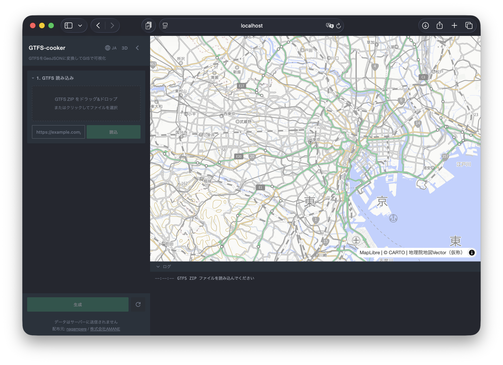
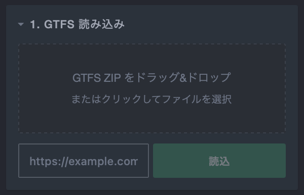
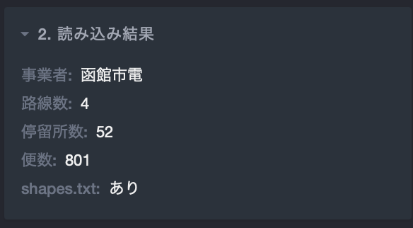
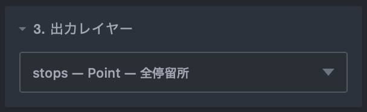
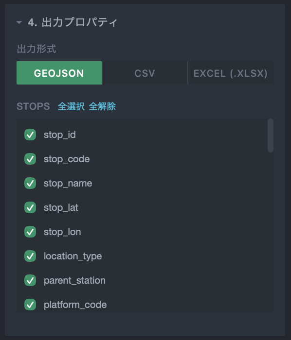

# 使い方

GTFS-cooker の基本的な操作手順を説明します。

## 1. GTFS ファイルの読み込み

サイドバーの「1. GTFS 読み込み」セクションで、GTFS ZIP ファイルを読み込みます。

- **ドラッグ&ドロップ** — ZIP ファイルをドロップゾーンにドラッグ&ドロップします。
- **ファイル選択** — ドロップゾーンをクリックしてファイルを選択します。
- **URL 入力** — GTFS ZIP の URL を入力して「読込」ボタンを押します。

::: tip
GTFS データは [GTFS オープンデータ一覧](https://gtfs-data.jp/) や [公共交通オープンデータセンターデータセット](https://ckan.odpt.org/dataset) などから取得できます。
:::

読み込みが完了すると、「2. 読み込み結果」に事業者名・路線数・停留所数・便数が表示されます。バリデーションエラーがある場合は警告が表示されます。

## 2. 出力レイヤーの選択

「3. 出力レイヤー」セクションで、生成したいレイヤーをドロップダウンから選択します。

| カテゴリ | レイヤー | 説明 |
|---------|---------|------|
| 基本 | Stops | 全停留所のポイント |
| 基本 | Lines | 路線の形状 |
| 基本 | Trips | 便の軌跡（Kepler.gl Trip 形式） |
| バッファ | Stops Buffer / Lines Buffer | 停留所・路線のバッファ |
| ディゾルブ | Stops Dissolved / Lines Dissolved | バッファの結合 |
| エリア | Envelope / Convex / Concave | バウンディングボックス・凸包・凹包 |
| セグメント | Segments | 停留所間の区間 |
| Matching | Matching Stops / Lines / Segments / Flow / OD | 乗降実績データとの結合 |

レイヤーによっては追加のパラメータ（基準日、バッファ半径など）が表示されます。各レイヤーの詳細は [機能一覧](./features) を参照してください。

## 3. 出力プロパティの選択

「4. 出力プロパティ」セクションで、GeoJSON に含めるプロパティを選択します。

- **出力形式** — GeoJSON / CSV / XLSX から選択できます。
- **プロパティ選択** — 「全選択」「全解除」ボタンで一括操作、または個別にチェックボックスで選択できます。

## 4. 生成とダウンロード

「生成」ボタンをクリックすると、選択したレイヤーが生成されます。生成結果は地図上にプレビュー表示され、フィーチャーにマウスオーバーするとプロパティを確認できます。

生成が完了すると「生成」ボタン左の download ボタンがクリック可能になります。クリックすると、「4. 出力プロパティ」で選択した形式（GeoJSON / CSV / XLSX）でファイルがダウンロードされます。

ダウンロードしたファイルは、以下のような GIS ツールで可視化・分析に活用できます。

- **[Kepler.gl](https://kepler.gl/)** — ブラウザ上でドラッグ&ドロップするだけで地図上に可視化できます。GeoJSON・CSV に対応しています。Trips レイヤーを読み込めば時系列アニメーションも可能です。
- **[QGIS](https://qgis.org/)** — デスクトップ GIS ソフトウェアです。GeoJSON ファイルをそのまま読み込んで、スタイル設定や空間分析を行えます。
- **Excel / Google スプレッドシート** — CSV・XLSX 形式で出力すれば、表計算ソフトでプロパティの集計やグラフ作成に利用できます。

## 5. 地図の操作

- **2D / 3D 切り替え** — ヘッダーの「2D」「3D」ボタンで視点を切り替えられます。
- **パン** — マウスドラッグで地図を移動します。
- **ズーム** — マウスホイールでズームイン/アウトします。
- **回転（3D）** — 右クリック+ドラッグで視点を回転します。

## ログパネル

画面下部の「ログ」パネルで処理の進捗やエラーを確認できます。
