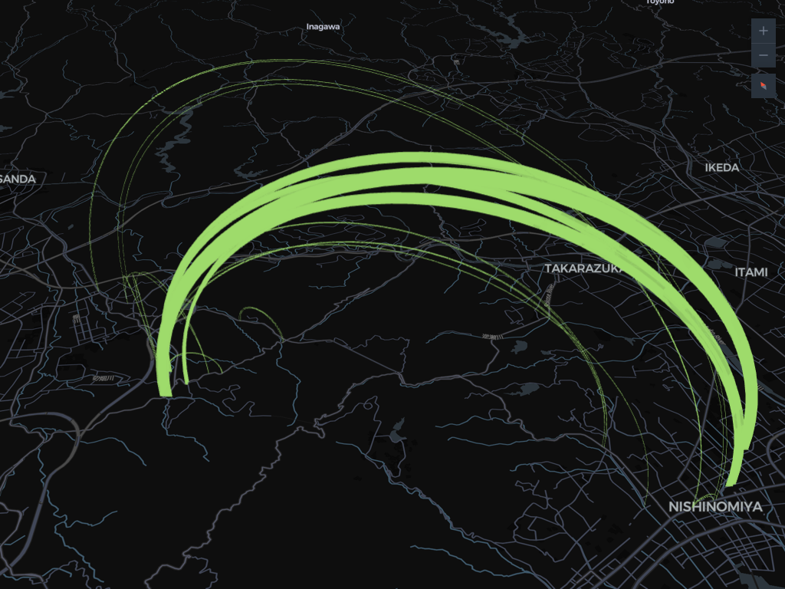
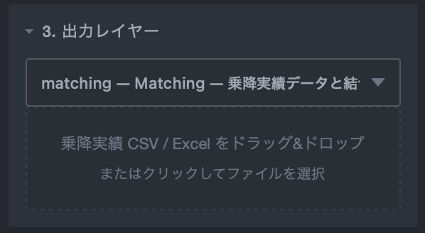
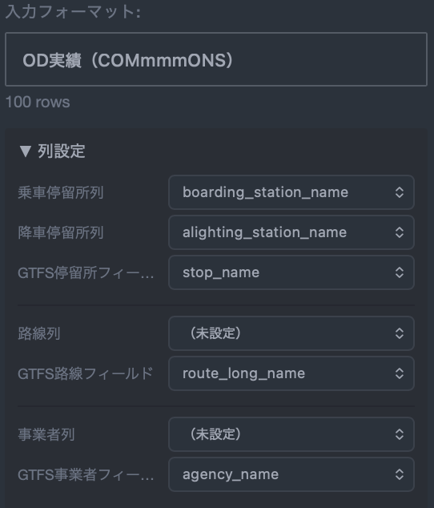
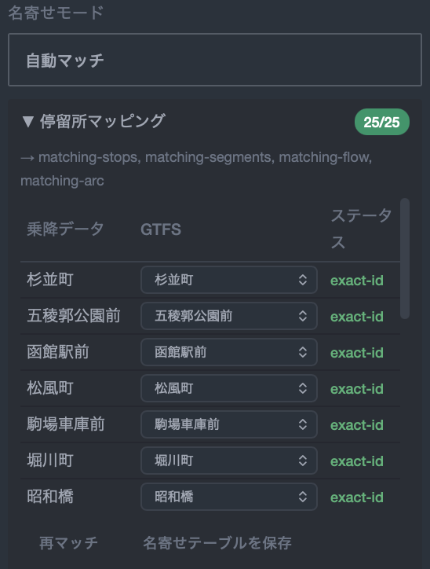

# Matching（乗降実績の結合）

<p align="center"></p>

GTFS-cooker の Matching 機能は、乗降実績データ（CSV / Excel）を GTFS データと結合し、停留所別・路線別・区間別・OD 流動の可視化レイヤーを生成します。

### 乗降実績データを結合するメリット

GTFS データ単体では路線の形状や時刻表は把握できますが、「どの停留所が多く利用されているか」「どの区間に需要が集中しているか」といった利用実態はわかりません。乗降実績データを結合することで、以下のような分析が可能になります。

- **停留所別の利用量の把握** — 乗車数・降車数を停留所ごとに可視化し、拠点性を評価できます。
- **路線・区間の需要分析** — 路線別・区間別の利用者数を比較し、需要の多寡を把握できます。
- **OD 流動の可視化** — 乗車地と降車地のペアを集約し、旅客の移動パターンをアーク（弧）で表現できます。
- **路線再編・ダイヤ改正の検討材料** — 利用の少ない区間や偏りのある時間帯を特定し、改善検討に活用できます。

## 概要フロー

```
乗降実績ファイル読み込み → フォーマット検出 → 列設定 → 名寄せ → 結合実行 → レイヤー生成
```

## 手順

### Step 1: 出力レイヤーで「Matching」を選択

「3. 出力レイヤー」のドロップダウンから **Matching — 乗降実績データと結合** を選択すると、サイドバー下部に「5. 乗降実績データ」セクションが表示されます。

### Step 2: 乗降実績ファイルの読み込み

CSV / Excel / TSV ファイルをドラッグ&ドロップ、またはファイル選択で読み込みます。

<p align="center"></p>

- Excel ファイルの場合、複数シートがあればシート選択ドロップダウンが表示されます。
- フォーマットはヘッダー行から自動検出されます。検出結果が合わない場合は手動で変更できます。

### Step 3: フォーマットと列設定

自動検出されたフォーマットを確認し、必要に応じて「列設定」パネルで各列の対応関係を設定します。

<p align="center"></p>

設定できる列：

| 列設定 | 説明 | 使用するレイヤー |
|--------|------|----------------|
| 乗車停留所列 | 乗車地の停留所名/ID | Stops, Segments, Flow, Arc |
| 降車停留所列 | 降車地の停留所名/ID | Segments, Flow, Arc |
| GTFS 停留所フィールド | 照合先（stop_id または stop_name） | — |
| 路線列 | 路線名/ID | Lines |
| GTFS 路線フィールド | 照合先（route_id / route_short_name / route_long_name） | — |
| 事業者列 | 事業者名/ID | — |
| 乗降数列 | 乗降数のカラム | 全レイヤー |

### Step 4: サブレイヤーの選択

列設定に応じて利用可能なサブレイヤーが表示されます。生成したいレイヤーを選択します。

<p align="center"></p>

| サブレイヤー | 必要な列設定 |
|-------------|-------------|
| Matching Stops | 乗車停留所 |
| Matching Lines | 路線 |
| Matching Segments | 乗車停留所 + 降車停留所 |
| Matching Flow | 乗車停留所 + 降車停留所 |
| Matching OD | 乗車停留所 + 降車停留所 |

### Step 5: 名寄せ（Reconciliation）

乗降実績データと GTFS の停留所名/ID を対応づけます。3 つのモードがあります。

<p align="center"></p>

#### ダイレクト（IDs match）

乗降実績の ID が GTFS の ID と一致している場合に使用します。追加操作なしで結合できます。

#### 自動マッチ

アルゴリズムが自動で名寄せを行います。マッチングの優先順位：

1. **ID 完全一致** — 実績側の値と GTFS ID が一致
2. **名称完全一致** — 実績側の値と GTFS 名称が一致
3. **正規化一致** — カタカナ/ひらがな変換・空白除去後に一致
4. **部分一致** — 一方が他方を含む場合に一致

結果はマッピングテーブルに表示されます。未マッチの項目は手動でドロップダウンから GTFS エンティティを選択して修正できます。

::: tip
「名寄せテーブルを保存」で現在のマッピングを CSV に書き出せます。次回以降「マッピング CSV アップロード」で再利用できます。
:::

#### マッピング CSV アップロード

事前に作成したマッピング CSV をアップロードします。

- **形式**: 1 列目 = 乗降実績側の値、2 列目 = GTFS 側の値
- ヘッダー行は不要です
- 1 つの乗降実績値に複数の GTFS 値をマッピングできます（複数行に記述）

### Step 6: 結合実行

「結合実行」ボタンを押すと、名寄せ結果に基づいてデータが結合されます。

<p align="center"></p>

結合結果として以下の統計が表示されます：

- **マッチ数 / 未マッチ数** — 結合できたレコード数と結合できなかったレコード数
- **停留所カバー率** — GTFS 停留所のうち乗降実績データにマッチした割合
- **路線カバー率** — GTFS 路線のうち乗降実績データにマッチした割合

### Step 7: 生成とダウンロード

通常のレイヤーと同様に「生成」ボタンでレイヤーを生成し、地図プレビューで確認、ダウンロードできます。

## 対応フォーマット一覧

| フォーマット | 説明 | 典型的なデータソース |
|-------------|------|-------------------|
| OD 実績（COMmmmONS） | IC カードデータの個票形式 | COMmmmONS プラットフォーム |
| 乗降実績(一件明細) | 汎用的な OD 個票形式 | 各種調査データ |
| OD 集計 | OD ペアごとの集約データ | OD 調査結果 |
| 停留所集計 | 停留所ごとの乗降数集約 | 停留所別乗降調査 |
| 系統集計 | 路線（系統）ごとの集約データ | 路線別乗降調査 |
| 停留所×便別実績 | 停留所と便の組み合わせ別の詳細データ | バスロケーションシステム |
