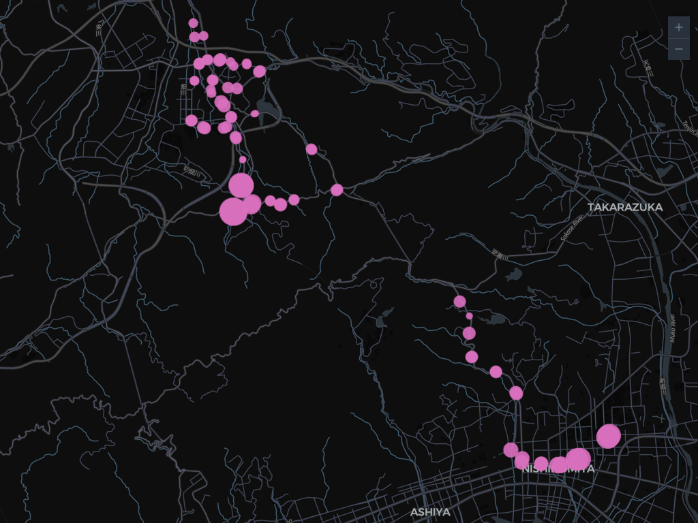
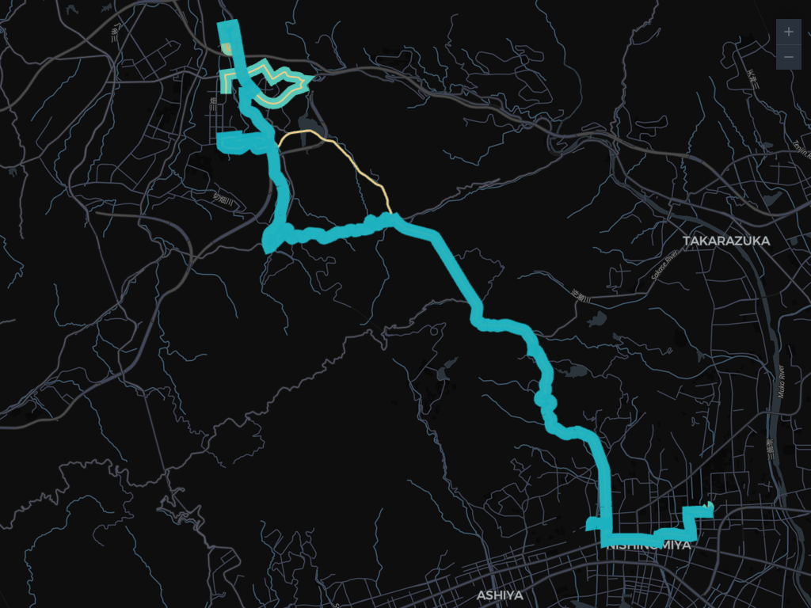
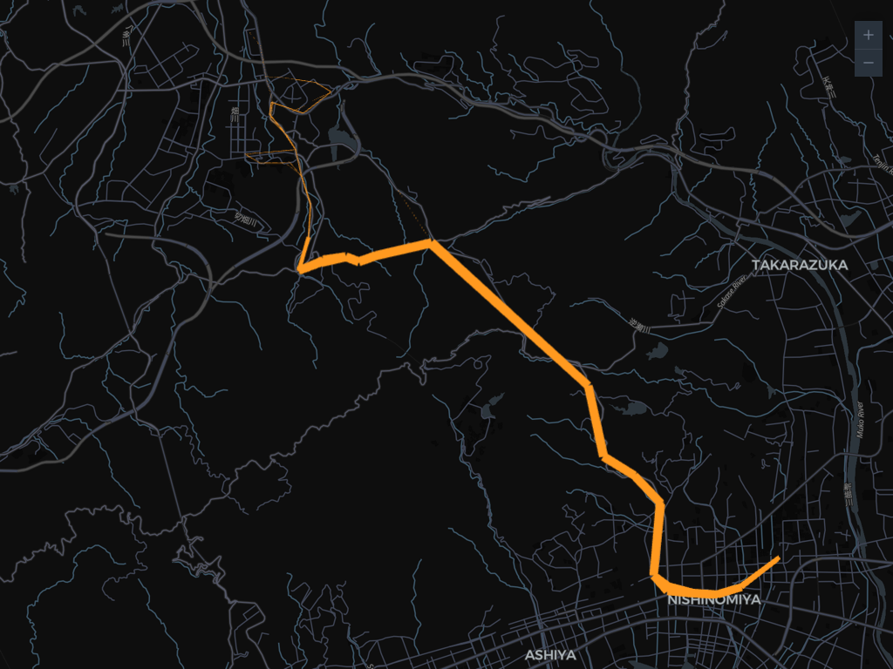
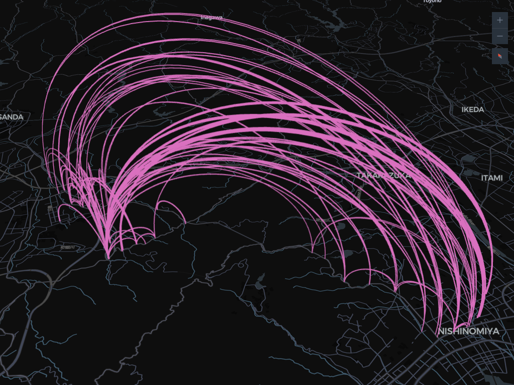

# Matching（乗降実績の結合）

<p align="center"></p>

GTFS-cooker の Matching 機能は、乗降実績データ（CSV / Excel）を GTFS データと結合し、停留所別・路線別・区間別・OD 流動の可視化レイヤーを生成します。

### 乗降実績データを結合するメリット

GTFS データ単体では路線の形状や時刻表は把握できますが、「どの停留所が多く利用されているか」「どの区間に需要が集中しているか」といった利用実態はわかりません。乗降実績データを結合することで、以下のような分析が可能になります。

- **停留所別の利用量の把握** — 乗車数・降車数を停留所ごとに可視化し、拠点性を評価できます。
- **路線・区間の需要分析** — 路線別・区間別の利用者数を比較し、需要の多寡を把握できます。
- **OD 流動の可視化** — 乗車地と降車地のペアを集約し、旅客の移動パターンをアーク（弧）で表現できます。
- **路線再編・ダイヤ改正の検討材料** — 利用の少ない区間や偏りのある時間帯を特定し、改善検討に活用できます。

## 概要フロー

```
乗降実績ファイル読み込み → フォーマット検出 → 列設定 → 名寄せ → 結合実行 → レイヤー生成
```

## 手順

### Step 1: 出力レイヤーで「Matching」を選択

「3. 出力レイヤー」のドロップダウンから **Matching — 乗降実績データと結合** を選択すると、サイドバー下部に「5. 乗降実績データ」セクションが表示されます。

### Step 2: 乗降実績ファイルの読み込み

CSV / Excel / TSV ファイルをドラッグ&ドロップ、またはファイル選択で読み込みます。

<p align="center"></p>

- Excel ファイルの場合、複数シートがあればシート選択ドロップダウンが表示されます。
- フォーマットはヘッダー行から自動検出されます。検出結果が合わない場合は手動で変更できます。

### Step 3: フォーマットと列設定

自動検出されたフォーマットを確認し、必要に応じて「列設定」パネルで各列の対応関係を設定します。フォーマットによって表示される列設定項目と必須項目が異なります。

<p align="center"></p>

#### 列設定項目の一覧

| 列設定 | 説明 | サブレイヤーへの影響 |
|--------|------|--------------------|
| 乗車停留所列 | 乗車地の停留所名/ID | matching-stops, matching-segments, matching-flow, matching-od |
| 降車停留所列 | 降車地の停留所名/ID | matching-segments, matching-flow, matching-od |
| GTFS 停留所フィールド | 照合先（`stop_id` / `stop_name`） | 上記 stop 系すべて |
| 路線列 | 路線名/ID | matching-lines、`route filter` の照合キー |
| GTFS 路線フィールド | 照合先（`route_id` / `route_short_name` / `route_long_name`） | matching-lines |
| 事業者列 | 事業者名/ID | （現在は集計には未使用） |
| GTFS 事業者フィールド | 照合先（`agency_id` / `agency_name`） | （同上） |
| 乗車数列 / 降車数列 | 乗車・降車のカラムを分けて指定（`count_on` / `count_off`） | stop の `ridership_on` / `ridership_off` |
| 乗降数列（複数） | 加算合計で 1 件あたりの乗車人数とみなす | 全 ridership 値 |
| 便ID列 | 便（trip）ID。trip 単位の通過人数計算に必要 | matching-segments（trip-detail 経路） |
| 通過人数列 | 当該停留所での通過人数 | matching-segments（trip-detail 経路） |
| 日付列 | 任意。日付と時刻が別カラムに分かれている場合に設定。`boarding_date` / `運行日` / `日付` などを自動検知。対応フォーマット: `YYYY-MM-DD` / `YYYY/MM/DD` / `YYYYMMDD` / `MM/DD/YYYY` 等 | matching-trips / matching-ridership |
| 時刻列 | 時間帯別集計および便割り当て用。**停留所×便別実績では必須**。`boarding_at` / `payment_at` / `datetime` / `時刻` などを自動検知。<br>**日付列が未設定**の場合: `2026-05-21 07:47:17` のような datetime 形式が前提。<br>**日付列が設定済**の場合: 時刻のみ（`07:47:17` / `07:47` / `7` 等）を想定。 | 全レイヤーの `ridership_XX` / 時間帯列 |

時刻列を設定すると `HH:MM:SS` / `YYYY-MM-DD HH:MM:SS` / ISO 8601 / 単純な整数（時）などのフォーマットから時刻が抽出され、`ridership_morning`〜`ridership_latenight` と `ridership_04`〜`ridership_27` の列が出力プロパティに追加されます。GTFS の `trip_XX` と同じ時間帯区分（朝 4-8 / 日中 9-16 / 夕 17-20 / 夜 21-27）です。

#### フォーマット別の列設定方法

##### OD実績（COMmmmONS） / 乗降実績（一件明細）

IC カードや乗降記録の **個票（1 行 = 1 回の乗降）** が前提です。1 行が乗車と降車の両方の情報を持ちます。

::: tip 参考
COMmmmONS のデータ仕様は国土交通省 [公共交通データ標準仕様（COMmmmONS）](https://www.mlit.go.jp/commmmons/document/005/) を参照してください。
:::

| 必須 | 列設定 | 典型カラム名 |
|------|--------|--------------|
| ✅ | 乗車停留所列 | `boarding_station_name` / `boarding_station_code` |
| ✅ | 降車停留所列 | `alighting_station_name` / `alighting_station_code` |
| ✅ | 乗降数列（複数） | `adult_passenger_count` ほか年齢区分カラム |
| 任意 | 路線列 | `boarding_route_id`（GTFS 側は `route_id` で照合） |
| 任意 | 事業者列 | `operating_agency_name` / `operating_agency_code` |
| 任意 | 時刻列 | `payment_at`（タイムスタンプ） |

→ 生成可能：matching-stops, matching-lines, matching-segments, matching-flow, matching-od

##### OD集計

OD ペアごとに件数を集計した形式です。1 行 = 1 OD ペア。

| 必須 | 列設定 | 典型カラム名 |
|------|--------|--------------|
| ✅ | 乗車停留所列 | `boarding_station_name` / `boarding_station_code` |
| ✅ | 降車停留所列 | `alighting_station_name` / `alighting_station_code` |
| ✅ | 乗降数列 | `count` |
| 任意 | 路線列 / 事業者列 | — |
| 任意 | 時刻列 | `hour` / `time_band` など |

→ 生成可能：matching-stops, matching-segments, matching-flow, matching-od（路線列があれば matching-lines も）

##### 停留所集計

停留所ごとの乗車数・降車数を集計した形式です。降車地情報がないため OD 系レイヤーは作れません。

| 必須 | 列設定 | 典型カラム名 |
|------|--------|--------------|
| ✅ | 乗車停留所列 | `station_name` / `station_code` |
| ✅ | 乗車数列 | `count_on` |
| ✅ | 降車数列 | `count_off` |
| 任意 | 時刻列 | `hour` / `time_band` |

→ 生成可能：matching-stops のみ

##### 系統集計

路線（系統）ごとの利用者数集計です。停留所情報がないため stop / segment / OD 系は作れません。

| 必須 | 列設定 | 典型カラム名 |
|------|--------|--------------|
| ✅ | 路線列 | `boarding_route_name` / `route_name` / `route_id` |
| ✅ | 乗降数列 | `count` |
| 任意 | 事業者列 / 時刻列 | — |

→ 生成可能：matching-lines のみ

##### 停留所×便別実績

停留所と便（trip）の組み合わせ別に乗車・降車・通過を持つ詳細形式。降車停留所列が無い代わりに **便ID + 時刻列 + 通過人数** から、便内の停留所順序を時刻で並べて区間ごとの通過人数を計算します。

| 必須 | 列設定 | 典型カラム名 |
|------|--------|--------------|
| ✅ | 停留所列 | `停留所名` / `停留所ID` |
| ✅ | 乗車数列 | `乗車人数` |
| ✅ | 降車数列 | `降車人数` |
| ✅ | 便ID列 | `便ID` |
| ✅ | 通過人数列 | `通過人数` |
| ✅ | 時刻列 | `時刻` / `発車時刻` / `datetime` など |
| 任意 | 路線列 | `路線名` / `路線ID` |

時刻列はデータ読み込み時に自動検知されてデフォルト設定されます。便内の停留所順序キーと時間帯別集計（`ridership_morning`〜`ridership_27`）の両方に使用されるため、このフォーマットでは必須です。

→ 生成可能：matching-stops, matching-segments（trip-detail 経路）、路線列があれば matching-lines も

### Step 3.5: 追加オプション

サブレイヤーの選択の下に以下のオプションがあります。

- **路線で絞り込み**（任意） — `route_id` / `route_short_name` / `route_long_name` のいずれかに含まれる文字列を入力すると、その路線に関係する feature だけが出力に残ります。matching-stops では当該路線に停車する停留所のみ、matching-lines / matching-segments ではプロパティに合致する feature のみが対象です。
- **便あたり乗車人数の列を追加**（チェックボックス） — オンにすると `ridership_per_trip` および各時間帯版（`ridership_per_trip_04`〜`ridership_per_trip_27`、`ridership_per_trip_morning`〜`ridership_per_trip_latenight`）が追加されます。同じ feature に存在する `trip_weekday`+`trip_holiday` および `trip_XX` を分母にして算出します（時間帯別 ridership が `0`／分母が `0` の場合は列が付与されません）。

### Step 4: サブレイヤーの選択

列設定に応じて利用可能なサブレイヤーが表示されます。生成したいレイヤーを選択します。

<p align="center"></p>

| サブレイヤー | 必要な列設定 |
|-------------|-------------|
| Matching Stops | 乗車停留所 |
| Matching Lines | 路線 |
| Matching Segments | 乗車停留所 + 降車停留所（または停留所×便別実績） |
| Matching Flow | 乗車停留所 + 降車停留所 |
| Matching OD | 乗車停留所 + 降車停留所 |
| Matching Trips | 乗車停留所 + 降車停留所 + 時刻列、または停留所×便別実績 |
| Matching Ridership | 乗車停留所 + 降車停留所 + 時刻列（OD 個票のみ） |

### Step 5: 名寄せ（Reconciliation）

乗降実績データと GTFS の停留所名/ID を対応づけます。3 つのモードがあります。

<p align="center"></p>

#### ダイレクト（IDs match）

乗降実績の ID が GTFS の ID と一致している場合に使用します。追加操作なしで結合できます。

#### 自動マッチ

アルゴリズムが自動で名寄せを行います。マッチングの優先順位：

1. **ID 完全一致** — 実績側の値と GTFS ID が一致
2. **名称完全一致** — 実績側の値と GTFS 名称が一致
3. **正規化一致** — カタカナ/ひらがな変換・空白除去後に一致
4. **部分一致** — 一方が他方を含む場合に一致

結果はマッピングテーブルに表示され、各行のステータス列に `exact-id` / `exact-name` / `normalized` / `partial` / `unmatched` のいずれかが表示されます。

##### 手動でマッピングを修正する

**`unmatched`（未マッチ）の行**や、自動マッチ結果が誤っている行は、テーブルの GTFS 側ドロップダウンから候補を選び直すことで手動で対応づけできます。

- ドロップダウンには未使用の GTFS エンティティが表示されます（他の行で既に選択されている候補は重複防止のため非表示）。
- 候補を選ぶとステータスが `manual` に変わり、結合実行時にマッチとして扱われます。
- 逆に空欄（`—`）を選ぶとステータスが `skipped` になり、その行は集計対象から外れます。
- 誤った自動マッチを直したい場合も同様に、ドロップダウンから別候補を選ぶだけで上書きできます。

修正後に「結合実行」をもう一度押すと、`manual` ステータスの行も含めて再集計されます。

::: tip
「名寄せテーブルを保存」で現在のマッピング（自動マッチ＋手動修正の結果）を CSV に書き出せます。次回以降「マッピング CSV アップロード」で再利用できます。
:::

#### マッピング CSV アップロード

事前に作成したマッピング CSV をアップロードします。

- **形式**: 1 列目 = 乗降実績側の値、2 列目 = GTFS 側の値
- ヘッダー行は不要です
- 1 つの乗降実績値に複数の GTFS 値をマッピングできます（複数行に記述）

### Step 6: 結合実行

「結合実行」ボタンを押すと、名寄せ結果に基づいてデータが結合されます。

<p align="center"></p>

結合結果として以下の統計が表示されます：

- **マッチ数 / 未マッチ数** — 結合できたレコード数と結合できなかったレコード数
- **停留所カバー率** — GTFS 停留所のうち乗降実績データにマッチした割合
- **路線カバー率** — GTFS 路線のうち乗降実績データにマッチした割合

### Step 7: 生成とダウンロード

通常のレイヤーと同様に「生成」ボタンでレイヤーを生成し、地図プレビューで確認、ダウンロードできます。サブレイヤーごとに出力する内容と可視化が異なります。

#### Matching Stops（Point）

停留所単位で乗降数を可視化します。

<p align="center"></p>

- **ジオメトリ**: Point（GTFS Stops と同じ位置）
- **円のサイズ**: `ridership_on`もしくは`ridership_off` に応じて、利用者数が多い停留所ほど大きく表示されます。
- **主要プロパティ**:
  - GTFS Stops レイヤーの全プロパティ（`stop_id` / `stop_name` / `routes` / `trip_weekday` / `trip_morning` 〜 `trip_27` ほか）
  - `ridership_on`（総乗車数）, `ridership_off`（総降車数）
  - 時刻列を設定している場合: `ridership_morning` 〜 `ridership_latenight`, `ridership_04` 〜 `ridership_27`（各時間帯の乗降合計）
  - 「便あたり乗車人数」チェックON時: `ridership_per_trip` および時間帯別/時間別の `ridership_per_trip_*`
- **用途**: 拠点性の評価、停留所別の需要分析、特定時間帯のみ集中する停留所の抽出。

#### Matching Lines（MultiLineString）

路線単位で乗降数を可視化します。

<p align="center"></p>

- **ジオメトリ**: MultiLineString（GTFS Lines と同じ路線形状）
- **線の太さ**: `ridership_count` に応じて、利用者数が多い路線ほど太く描画されます。
- **主要プロパティ**: `route_id` / `route_short_name` / `route_long_name` / `ridership_count` ＋時間帯別 `ridership_*` ＋ `ridership_per_trip_*`
- **用途**: 路線別の需要比較、混雑路線の特定、時間帯別の路線利用パターン分析。

#### Matching Segments（LineString）

隣接停留所間（区間）の通過人数を可視化します。

<p align="center"></p>

- **ジオメトリ**: LineString（停留所間の直線または GTFS Segments と同じ区間形状）
- **線の太さ**: `ridership` に応じて、通過人数が多い区間ほど太く描画されます。
- **主要プロパティ**:
  - `from_stop_id` / `from_stop_name` / `from_stop_lat` / `from_stop_lon`
  - `to_stop_id` / `to_stop_name` / `to_stop_lat` / `to_stop_lon`
  - `ridership`（区間通過人数）
  - 時刻列を設定している場合: `ridership_morning` 〜 `ridership_27`
  - 「便あたり乗車人数」チェックON時: `ridership_per_trip_*`
- **用途**: 路線内の混雑区間特定、ボトルネック検出、区間別の需要変動分析。

#### Matching Flow（Arc, OD 集約）

OD ペア（乗車地 → 降車地）を集約してアークで可視化します。

<p align="center"></p>

- **ジオメトリ**: LineString（アークの始点・終点）
- **線の太さ**: `ridership` に応じて、流動量が多い OD ペアほど太く描画されます。
- **主要プロパティ**:
  - `boarding_stop_id` / `boarding_stop_name` / `boarding_lat` / `boarding_lon`
  - `alighting_stop_id` / `alighting_stop_name` / `alighting_lat` / `alighting_lon`
  - `ridership`（OD ペアの集計値）
  - 時刻列を設定している場合: `ridership_morning` 〜 `ridership_27`
- **用途**: 主要 OD 流動の把握、起終点パターン分析、ハブ停留所の検出。

#### Matching OD（Arc, 個票）

OD レコードを集約せず、1 個票ごとに 1 本のアークを描画します。

<p align="center"></p>

- **ジオメトリ**: LineString
- **線の太さ**: `passenger_count`（1~2程度なので、細い）
- **主要プロパティ**:
  - `boarding_stop_id` / `boarding_stop_name` / `boarding_lat` / `boarding_lon`
  - `alighting_stop_id` / `alighting_stop_name` / `alighting_lat` / `alighting_lon`
  - `passenger_count`（1 個票あたりの乗客数）
- **用途**: 個票レベルでの分析、外部 BI ツールでの集計、OD パターンの個別検証。

#### Matching Trips（LineString, 便×区間）

OD 個票を GTFS の特定 trip に時刻ベースで割り当て、**便ごと・区間ごとの乗車中人数 (`onboard`)** を可視化します。停留所×便別実績フォーマットでは `通過人数` 列がそのまま `onboard` として使われます（推定不要）。

- **ジオメトリ**: LineString（1 feature = 1 trip の 1 区間。隣接停留所間の直線）
- **線の太さ**: `onboard` に応じて `√(onboard) × 1.5`
- **主要プロパティ**:
  - `trip_id`, `route_id`, `route_short_name`, `route_long_name`, `direction_id`, `service_id`
  - `from_stop_id` / `from_stop_name`
  - `to_stop_id` / `to_stop_name`
  - `departure_time`, `arrival_time`（GTFS 由来。停留所×便別実績ではデータ側の時刻）
  - `onboard`（区間通過時の乗車中人数）
  - `boardings_at_from` / `alightings_at_to`（各端での乗降人数）
- **対応フォーマット**: OD実績(COMmmmONS) / 乗降実績(一件明細, 時刻列あり) / 停留所×便別実績
- **用途**: 特定便の混雑推移、便別ピーク区間の特定、ダイヤ改正・増発検討
- **trip 一意化**: 内部的に `(日付, 路線列, 便ID列)` の複合キーで便を識別。データに `路線ID` と `経路ID` の二段階がある場合は、**経路パターンを一意に識別する列（経路ID）**を `路線列` に設定するのが推奨。同じ路線 ID 下で異なる経路に同じ便 ID が含まれる場合に merge を防ぐため。
- **サービスカレンダー連携**: 各乗降日に対して GTFS の `calendar.txt` + `calendar_dates.txt` を参照し、当日アクティブな service_id の便のみを割り当て候補とします（trips レイヤーの基準日フィルタと同じロジック）。

#### Matching Ridership（LineString, 個票単位の軌跡）

OD 個票 1 件ごとに、割り当てられた便の停留所列に沿って軌跡を生成。**Kepler.gl Trip 形式**（座標 + タイムスタンプ）で出力され、時刻ベースのアニメーションに対応可能。

- **ジオメトリ**: LineString（1 feature = 1 個票。乗車地から降車地までの停留所列を結ぶ）
- **座標形式**: `[lon, lat, 0, unix_seconds]` の 4 要素（Kepler.gl Trip 形式）
- **主要プロパティ**:
  - `ridership_record_id`, `trip_id`, `route_id`, `route_short_name`
  - `boarding_stop_id` / `boarding_stop_name` / `boarding_time`
  - `alighting_stop_id` / `alighting_stop_name` / `alighting_time`
  - `passenger_count`, `duration_min`
- **対応フォーマット**: OD実績(COMmmmONS) / 乗降実績(一件明細, 時刻列あり)のみ。OD 集計や停留所×便別実績は OD リンクが失われているため非対応
- **用途**: 時刻別の乗客分布の可視化、Kepler.gl 等での時系列アニメ、ピーク時間帯の動線分析

::: tip
ダウンロード形式は GeoJSON / CSV / Excel（.xlsx）から選択できます。CSV/XLSX ではジオメトリ列の代わりに `_longitude` / `_latitude`（matching-stops 等）が追加されます。

matching-ridership を Kepler.gl にインポートすると、座標の 4 要素目（unix 秒）がそのまま時間軸として認識され、便ごとの乗客移動アニメーションが再生できます。
:::

### Step 8: タイムアニメーションと整合性チェック

#### タイムシークバー（trips / matching-trips / matching-ridership で表示）

時刻情報を持つレイヤー（`trips`, `matching-trips`, `matching-ridership`）を選択すると、地図下部に kepler.gl 風のタイムバーが現れます。

- **再生 / 一時停止 / リセット**: 標準的な再生コントロール
- **シークバー**: ドラッグで任意時刻にジャンプ
- **Trail**: 軌跡の表示長（30秒 / 1分 / 5分 / 10分 / 30分 / 1時間 / All）
- **Fade**: 軌跡を時間で薄くする
- **Speed**: 再生速度倍率（60x / 300x / **600x（既定）** / 1800x / 3600x）

時刻表示は `YYYY-MM-DD HH:MM:SS` 形式で、複数日にまたがるデータも識別可能です。

#### 便割り当て / GTFS 有効期限パネル

matching-trips / matching-ridership を生成すると、結合実行統計の下に **「便割り当て / GTFS 有効期限」** パネルが表示されます。

| 表示 | 状態 | 意味 |
|------|------|------|
| ✓ (緑枠) | 入力行 = 割り当て済み | すべての乗降データが GTFS のサービスカレンダーと整合 |
| ⚠ (黄枠) | dropped > 0 | 一部の乗降データに該当する便が GTFS に無い（feed 期間外 / 休止サービス等） |
| (info) | feed_info.txt 無し | 期間検証スキップ |

**「除外 (サービス無し)」** の行数は、`calendar.txt` / `calendar_dates.txt` の判定で当日アクティブな service_id が無いため割り当てができなかった乗降データを示します。**期間外の日数** は具体的にどの日付が feed 範囲外かを表示（5 日以下なら日付リスト併記）。

::: warning データロスに注意
GTFS feed 期間外の日付の乗降データは、matching-trips / matching-ridership の集計対象から**サイレントに除外**されます（feature が生成されない）。集計の総数が入力件数を下回る場合は、このパネルの「除外」行を確認してください。
:::


